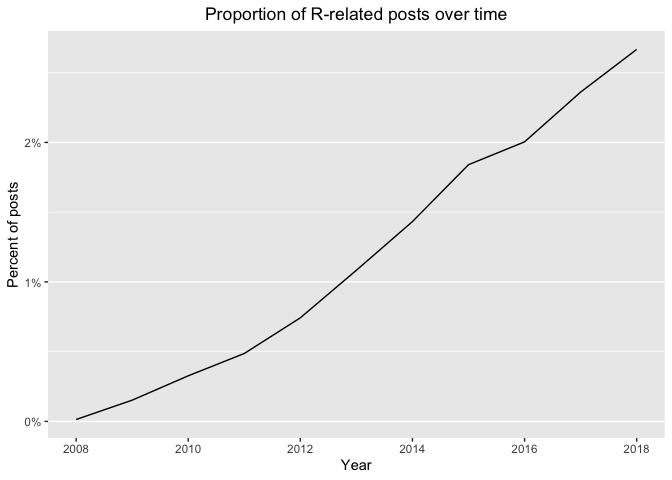
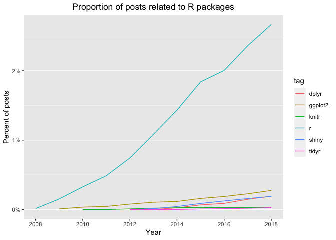
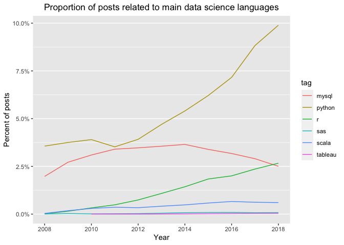
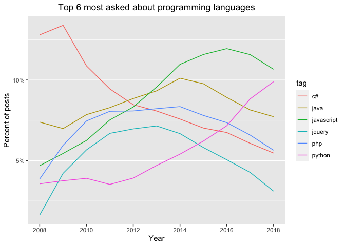
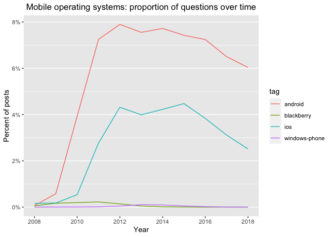

<style type="text/css">
  body{
  font-size: 12pt;
}
</style>


## 1. Introduction
  
In this exploratory analysis, I am interested in examining trends in different programming languages over time. As an epidemiologist, I was trained to use a number of different statistical software that perform the same essential tasks: cleaning and wrangling data, running statistical models, visualising data. Graduate school was only a few years ago, but the data analytics landscape that I find myself in today looks very different than what it did during my studies: I now rely on open-source platforms like R and Python more than on licensed products like SAS and Stata.

But is this perceived growth in popularity of R and Python real, and can we quantify it by looking at Stack Overflow data? And how does the popularity of these two coding languages compare to the popularity of other prominent languages used in other programming fields?

I will start this analysis by focusing on R and its packages. Then, we will consider other data science tools like Python, Scala, and Tableau. We will also look all other programming languages to determine which ones have been growing and shrinking in the last decade.

We will be using the most current dataset available for download at Stack Overflow's <a href="https://data.stackexchange.com/">Stack Exchange Data Explorer</a> - this dataset spans the years 2008 to 2018. It includes information on the number of questions asked on Stack Overflow for each programming language, as well as information on the number of views and answers for each question. This will be our proxy to assess the popularity and usage of different languages. 

  
  

```r
# Loading libraries, dataset, and inspecting dataset
library(readr)
library(dplyr)
library(scales)
library(knitr)

by_tag_year <- read.csv("https://raw.githubusercontent.com/MyreLab/programming_languages/main/stackoverflow_tags.csv")

head(by_tag_year, 10)
```

```
##    year           tag number year_total
## 1  2008     .htaccess     54      58390
## 2  2008          .net   5910      58390
## 3  2008      .net-2.0    289      58390
## 4  2008      .net-3.5    319      58390
## 5  2008      .net-4.0      6      58390
## 6  2008 .net-assembly      3      58390
## 7  2008     .net-core      1      58390
## 8  2008            2d     42      58390
## 9  2008        32-bit     19      58390
## 10 2008   32bit-64bit      4      58390
```

## 2. Calculating percentages  

We can see that the dataset has one observation for each pair of a tag and a year, showing the number of questions asked in that tag in that year and the total number of questions asked per year overall. For instance, there were 54 questions asked about the <code> .htaccess </code> tag in 2008, out of a total of 58,390 questions in that year.  

Rather than just using counts, like in the table above, we're interested in looking at proportions: the percentage of questions per year for a specific tag. In this step we're calculating these percentages.  
  

```r
# Add fraction column
by_tag_year_fraction <- mutate(by_tag_year, fraction = number/year_total)

head(by_tag_year_fraction, 10)
```

```
##    year           tag number year_total     fraction
## 1  2008     .htaccess     54      58390 9.248159e-04
## 2  2008          .net   5910      58390 1.012160e-01
## 3  2008      .net-2.0    289      58390 4.949478e-03
## 4  2008      .net-3.5    319      58390 5.463264e-03
## 5  2008      .net-4.0      6      58390 1.027573e-04
## 6  2008 .net-assembly      3      58390 5.137866e-05
## 7  2008     .net-core      1      58390 1.712622e-05
## 8  2008            2d     42      58390 7.193013e-04
## 9  2008        32-bit     19      58390 3.253982e-04
## 10 2008   32bit-64bit      4      58390 6.850488e-05
```

## 3. R: Visualising change over time  
  
Let's start by looking at how R has been faring in the last decade. Below, we're filtering for R tags and visualising change over time with a line plot. The results look promising: an increase of 2.5 percentage points in 10 years. This, however, could be an undercount, depending on whether users who submitted questions for <em>specific R packages</em> also used this general R tag in their posts. 


```r
# Filter for R tags
r_over_time <- filter(by_tag_year_fraction, tag == "r")
# head(r_over_time,15)

# Load ggplot2
library(ggplot2)

# Create a line plot of fraction over time
ggplot(r_over_time) + geom_line(aes(x = year, y = fraction)) + scale_x_continuous(breaks = pretty_breaks()) +
    scale_y_continuous(labels = percent) + ggtitle("Proportion of R-related posts over time") +
    xlab("Year") + ylab("Percent of posts") + theme(plot.title = element_text(hjust = 0.5),
    panel.grid.major.x = element_blank(), panel.grid.minor.x = element_blank())
```

<!-- -->


## 4. A closer look at R packages  
  
Speaking of R packages, there are many package-specific tags related to the R ecosystem that would be interesting to explore. Some of the ones that I can think of right now are dplyr, ggplot2, shiny, tidyr, and knitr. Let's create a vector with these tags to visualise their change over time. Are these tags also increasing as a fraction of overall questions? 

From the chart below, it looks like ggplot2, shiny, and dplyr are the leading packages in terms of the volume of questions received, but they do not generate as many questions as R overall (as expected). 


```r
# A vector of selected tags
selected_tags <- c("r", "dplyr", "ggplot2", "shiny", "tidyr", "knitr")

# Filter for tags
selected_tags_over_time <- filter(by_tag_year_fraction, tag %in% selected_tags)

# Plot tags over time
ggplot(selected_tags_over_time) + geom_line(aes(x = year, y = fraction,
    color = tag)) + scale_x_continuous(breaks = pretty_breaks()) + scale_y_continuous(labels = percent) +
    ggtitle("Proportion of posts related to R packages") + xlab("Year") +
    ylab("Percent of posts") + theme(plot.title = element_text(hjust = 0.5),
    panel.grid.major.x = element_blank(), panel.grid.minor.x = element_blank())
```

<!-- -->


## 5. Data science tools

Let's see what other data science tools we can feasibly compare using this dataset. Below, we're creating a vector that combines R, Python, Scala, Julia, MySQL, SAS, and Tableau. 

From the line plot created, it looks like we are able to compare all except for Julia (understandably, seeing as Julia is a newer platform). Python is hands-down the language with the fastest growth and largest proportion of questions asked in the time frame analysed. Scala shows stable popularity over time, but it seems like MySQL is experiencing a shrink in popularity.


```r
# A vector of data science tags
datasci_tags <- c("r", "python", "scala", "julia", "mysql", "sas", "tableau")
datasci_tags_over_time <- filter(by_tag_year_fraction, tag %in% datasci_tags)

# Create a line plot of fraction over time
ggplot(datasci_tags_over_time) + geom_line(aes(x = year, y = fraction,
    color = tag)) + scale_x_continuous(breaks = pretty_breaks()) + scale_y_continuous(labels = percent) +
    ggtitle("Proportion of posts related to main data science languages") +
    xlab("Year") + ylab("Percent of posts") + theme(plot.title = element_text(hjust = 0.5),
    panel.grid.major.x = element_blank(), panel.grid.minor.x = element_blank())
```

<!-- -->


## 6. How have other programming languages changed over time?

We've looked at select tags like R and Python, and seen that they're each growing. I'm interested to know which tags have the most questions <em>overall</em>, not just within a particular year. Right now, we have several rows for every tag, but we'll combine them into one. This will allow us to look at the languages that had the largest share of questions in this 10-year period. 

Below, we can see that while most languages experienced a decline from 2015 to 2018, Python's popularity skyrocketed in comparison.


```r
# total number of questions for each tag
sorted_tags <- by_tag_year %>%
    group_by(tag) %>%
    summarize(tag_total = sum(number)) %>%
    arrange(desc(tag_total))

head(sorted_tags, 10)
```

```
## # A tibble: 10 × 2
##    tag        tag_total
##    <chr>          <int>
##  1 javascript   1632049
##  2 java         1425961
##  3 c#           1217450
##  4 php          1204291
##  5 android      1110261
##  6 python        970768
##  7 jquery        915159
##  8 html          755341
##  9 c++           574263
## 10 ios           566075
```


```r
# Get largest tags
highest_tags <- head(sorted_tags$tag, 7)

# Remove android and ios (these will be compared in the next step)
highest_tags <- setdiff(highest_tags, c("ios", "android"))

# Filter for largest tags
by_tag_subset <- filter(by_tag_year_fraction, tag %in% highest_tags)

# Plot tags over time
ggplot(by_tag_subset) + geom_line(aes(x = year, y = fraction, color = tag)) +
    scale_x_continuous(breaks = pretty_breaks()) + scale_y_continuous(labels = percent) +
    ggtitle("Top 6 most asked about programming languages") + xlab("Year") +
    ylab("Percent of posts") + theme(plot.title = element_text(hjust = 0.5),
    panel.grid.major.x = element_blank(), panel.grid.minor.x = element_blank())
```

<!-- -->

## 7. Android, iOS, Windows, Blackberry 

Lastly, let's check out how the main mobile operating systems have compared in popularity over time. It seems like both Android and iOS experienced a sharp increase in tagged posts from 2009 to 2011, right around the time when smartphones were becoming mainstream. From 2015 onwards, however, we can see that the volume drastically decreased, especially for iOS. Perhaps mobile developers are fluctuating to different online channels?


```r
# Get tags of interest
my_tags <- c("android", "ios", "windows-phone", "blackberry")

# Filter for tags
by_tag_subset <- filter(by_tag_year_fraction, tag %in% my_tags)

# Plot tags over time
ggplot(by_tag_subset) + geom_line(aes(x = year, y = fraction, color = tag)) +
    scale_x_continuous(breaks = pretty_breaks()) + scale_y_continuous(labels = percent) +
    ggtitle("Mobile operating systems: proportion of questions over time") +
    xlab("Year") + ylab("Percent of posts") + theme(plot.title = element_text(hjust = 0.5),
    panel.grid.major.x = element_blank(), panel.grid.minor.x = element_blank())
```

<!-- -->


Acknowledgement: Datacamp. This analysis builds off of The Evolution of Programming Languages project.
